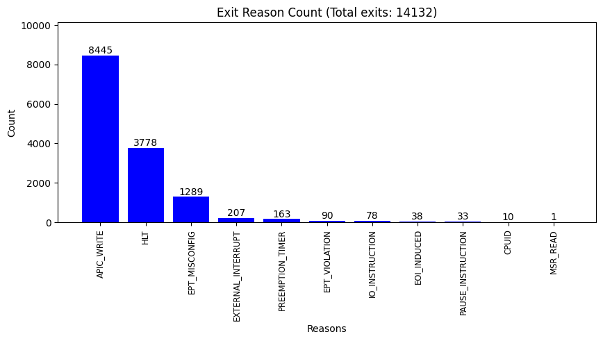

## kvm_exit_default
```
Total exits: 14132.
'APIC_WRITE': 8445 times
'HLT': 3778 times
'EPT_MISCONFIG': 1289 times
'PREEMPTION_TIMER': 163 times
'EXTERNAL_INTERRUPT': 207 times
'IO_INSTRUCTION': 78 times
'EOI_INDUCED': 38 times
'EPT_VIOLATION': 90 times
'PAUSE_INSTRUCTION': 33 times
'CPUID': 10 times
'MSR_READ': 1 times
```

