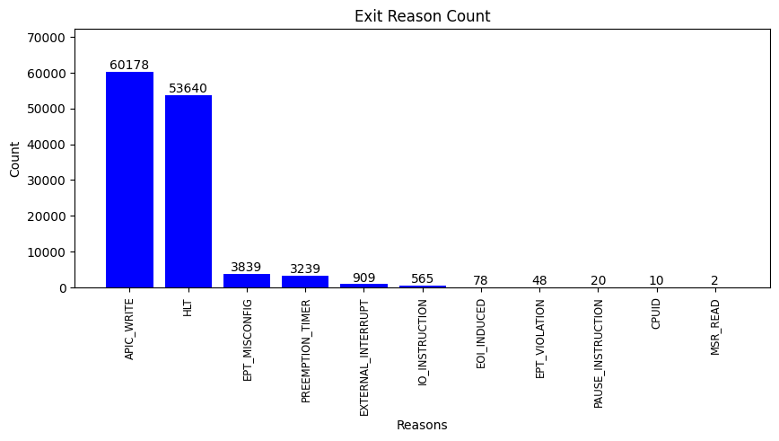

## kvm_exit
| Exit Reason         | Description                                               | Frequency     |
|---------------------|-----------------------------------------------------------|---------------|
| APIC_WRITE          | Triggered when the guest writes to its Advanced Programmable Interrupt Controller (APIC).                                  | 60178 times   |
| EXTERNAL_INTERRUPT  | Triggered when an external hardware interrupt occurs, usually caused by hardware devices signaling the host’s CPU.          | 909 times     |
| HLT                 | Triggered when the guest executes the HLT instruction, halting the CPU until the next external interrupt is fired.         | 53640 times   |
| EPT_MISCONFIG       | Triggered due to a misconfiguration in the Extended Page Tables (EPT), a memory management feature in modern CPUs.         | 3839 times    |
| PREEMPTION_TIMER    | Triggered when the preemption timer of the host expires, related to the host’s scheduling of the guest.                    | 3239 times    |
| PAUSE_INSTRUCTION   | Triggered when the PAUSE instruction is executed, used in spinlock loops to improve performance and reduce power consumption.| 20 times      |
| EPT_VIOLATION       | Triggered when a guest access to a page would result in a violation of the EPT permission settings.                        | 48 times      |
| IO_INSTRUCTION      | Triggered when the guest executes an I/O instruction, such as IN or OUT.                                                   | 565 times     |
| EOI_INDUCED         | Triggered when an end-of-interrupt (EOI) signal is sent to the APIC.                                                        | 78 times      |
| MSR_READ            | Triggered when the guest reads from a Model-Specific Register (MSR).                                                        | 2 times       |
| CPUID               | Triggered when the guest executes the CPUID instruction, used to identify the processor.                                    | 10 times      |

