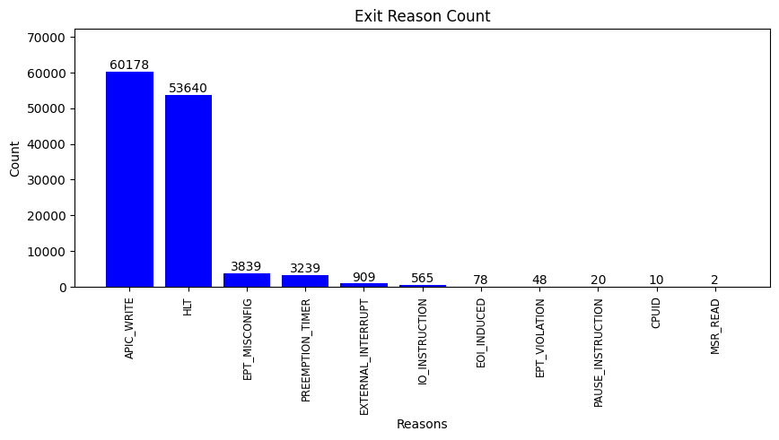

## kvm_exit
```
Total exits: 122528.
'APIC_WRITE': 60178 times
'HLT': 53640 times
'EPT_MISCONFIG': 3839 times
'PREEMPTION_TIMER': 3239 times
'EXTERNAL_INTERRUPT': 909 times
'IO_INSTRUCTION': 565 times
'EOI_INDUCED': 78 times
'EPT_VIOLATION': 48 times
'PAUSE_INSTRUCTION': 20 times
'CPUID': 10 times
'MSR_READ': 2 times
```

