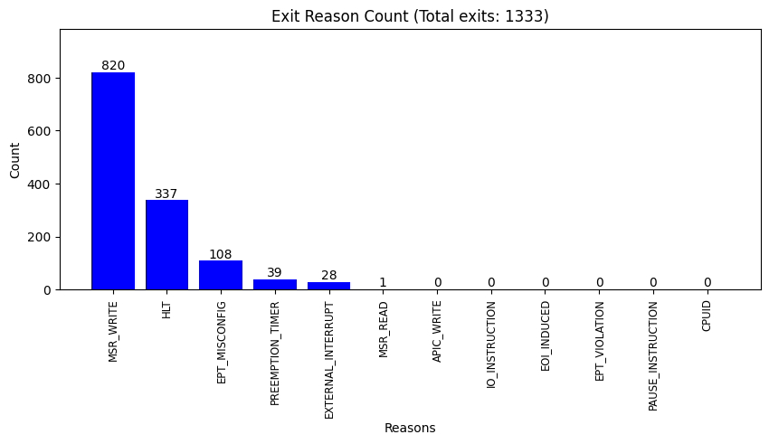

## kvm_exit
```
Total exits: 1333.
'MSR_WRITE': 820 times
'APIC_WRITE': 0 times
'HLT': 337 times
'EPT_MISCONFIG': 108 times
'PREEMPTION_TIMER': 39 times
'EXTERNAL_INTERRUPT': 28 times
'IO_INSTRUCTION': 0 times
'EOI_INDUCED': 0 times
'EPT_VIOLATION': 0 times
'PAUSE_INSTRUCTION': 0 times
'CPUID': 0 times
'MSR_READ': 1 times

```

