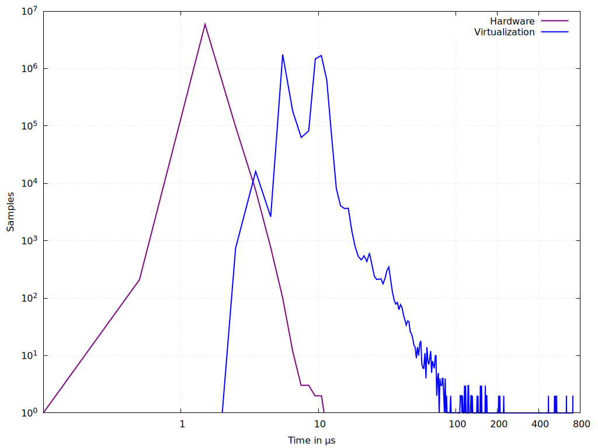

# gnuplot combined
```bash
# Set output to a PNG file
set terminal pngcairo enhanced font 'Arial,12' size 1024,768
set output 'gnuplot_combined_max_latency.png'
set encoding utf8

# Set the title and labels
#set title "Latency Distribution"
set xlabel 'Time in {/Symbol=12 m}s'
set ylabel "Frequency"

# Set the range for the x axis
set xrange [0:1000] # replace 1000 with 800 if you want the range to be until 800

# Set the x and y axes to logarithmic scale
set logscale x
set logscale y

# Remove minor ticks on the axes
set mxtics 1
set mytics 1

# Add grid lines for axes
set grid ytics
set grid xtics

# Plot the data with thicker lines and different colors
plot '../0hardware/max_latency_hardware_10min.txt' using 1:2 with lines linewidth 3 linecolor rgb "#800080" title 'Hardware', \
     '../1default/max_latency_default_10min.txt' using 1:2 with lines linewidth 3 linecolor rgb "blue" title 'Virtualization'
```


