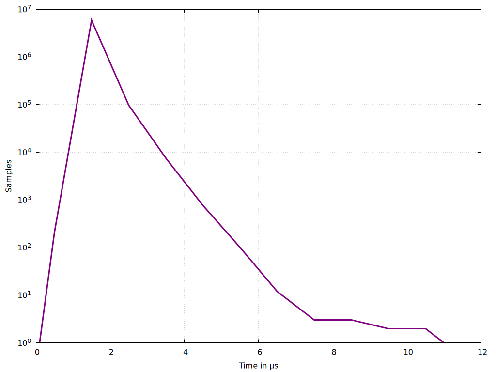

# gnuplot hardware
```bash
# Set output to a PNG file
set terminal pngcairo enhanced font 'Arial,10'
set output 'gnuplot_max_latency_hardware.png'
set encoding utf8

# Set the title and labels
#set title "Latency Distribution"
set xlabel 'Time in {/Symbol=9 m}s'
set ylabel "Frequency"

# Calculate statistics
stats 'max_latency_hardware_10min.txt' using 2 nooutput

# Plot the data with thicker lines
plot 'max_latency_hardware_10min.txt' using 1:2 with linespoints linewidth 3 title ''
```


