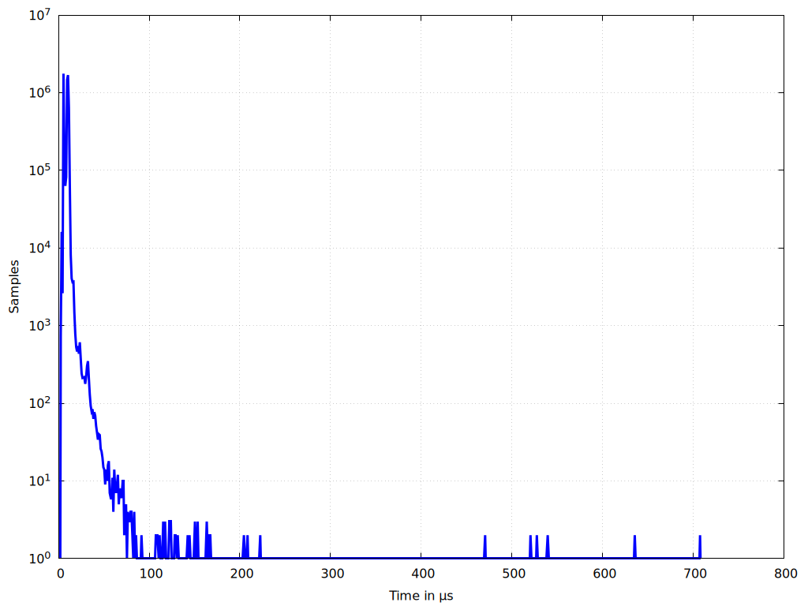

# gnuplot default
```bash
# Set output to a PNG file
set terminal pngcairo enhanced font 'Arial,10' size 1024,768
set output 'gnuplot_max_latency_default.png'
set encoding utf8

# Set the title and labels
#set title "Latency Distribution"
set xlabel 'Time in {/Symbol=9 m}s'
set ylabel "Frequency"

# Plot the data with thicker lines
plot 'max_latency_default_10min.txt' using 1:2 with linespoints linewidth 2 title ''
```

