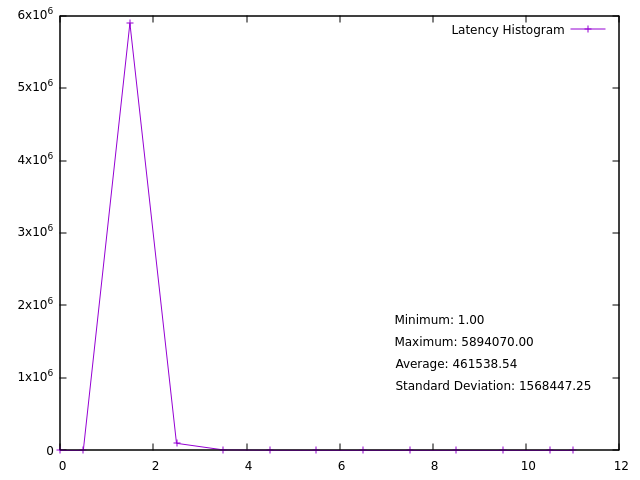

# gnuplot hardware
```
# Calculate statistics
stats 'latency_hardware_10min.txt' using 2 nooutput

# Define labels for the statistics
set label 1 sprintf("Minimum: %.2f", STATS_min) at graph 0.6, graph 0.3
set label 2 sprintf("Maximum: %.2f", STATS_max) at graph 0.6, graph 0.25
set label 3 sprintf("Average: %.2f", STATS_mean) at graph 0.6, graph 0.2
set label 4 sprintf("Standard Deviation: %.2f", STATS_stddev) at graph 0.6, graph 0.15

# Plot the data
plot 'latency_hardware_10min.txt' using 1:2 with linespoints title 'Latency Histogram'
```

