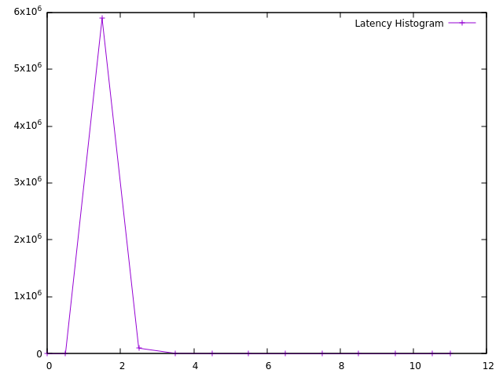

# gnuplot hardware
```
# Calculate statistics
stats 'max_latency_hardware_10min.txt' using 2 nooutput

# Plot the data
plot 'max_latency_hardware_10min.txt' using 1:2 with linespoints title 'Latency Histogram'
```

