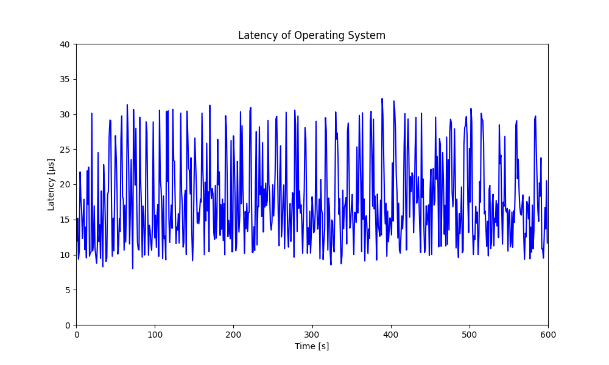

# Salamander 4 latency comparisons

## Salamander 4 Hardware on CP 841

- Average latency: 4.06us
- Max latency: 10.709us
- Min latency: 2.817us
- Standard Deviation: 0.85us

## Salamander 4 Default Yocto Build

- Average latency: 174.5us
- Max latency: 4070.018us
- Min latency: 6.963us
- Standard Deviation: 359.27us

---

## After taskset -c 13

- Average latency: 74.78us
- Max latency: 457.545us
- Min latency: 14.113us
- Standard Deviation: 29.43us

## After PREEMPT_RT Patch and Kernel Tuning

- Average latency: 17.68us
- Max latency: 32.216us
- Min latency: 8.005us
- Standard Deviation: 6.1us

---

## After BIOS settings und Kernel Parameters

- Average latency: 14.0us
- Max latency: 21.694us
- Min latency: 6.351us
- Standard Deviation: 1.44us

## After Host Configurations

- Average latency: 12.61us
- Max latency: 17.041us
- Min latency: 7.872us
- Standard Deviation: 1.8us

---

## After QEMU Configurations

- Average latency: 16.26us
- Max latency: 17.134us
- Min latency: 14.532us
- Standard Deviation: 0.3us
