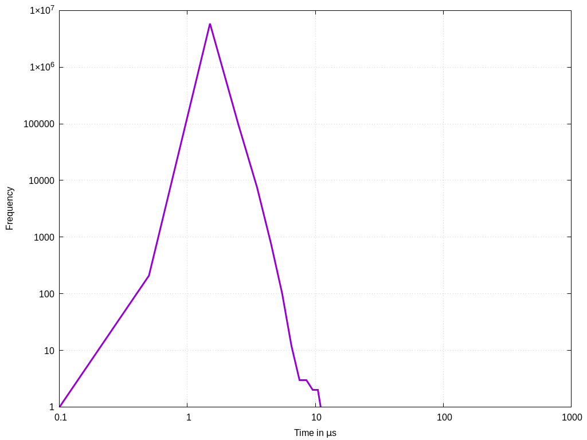
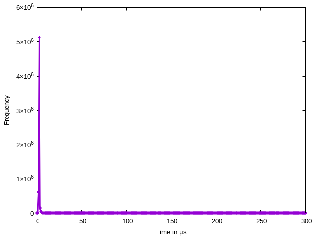
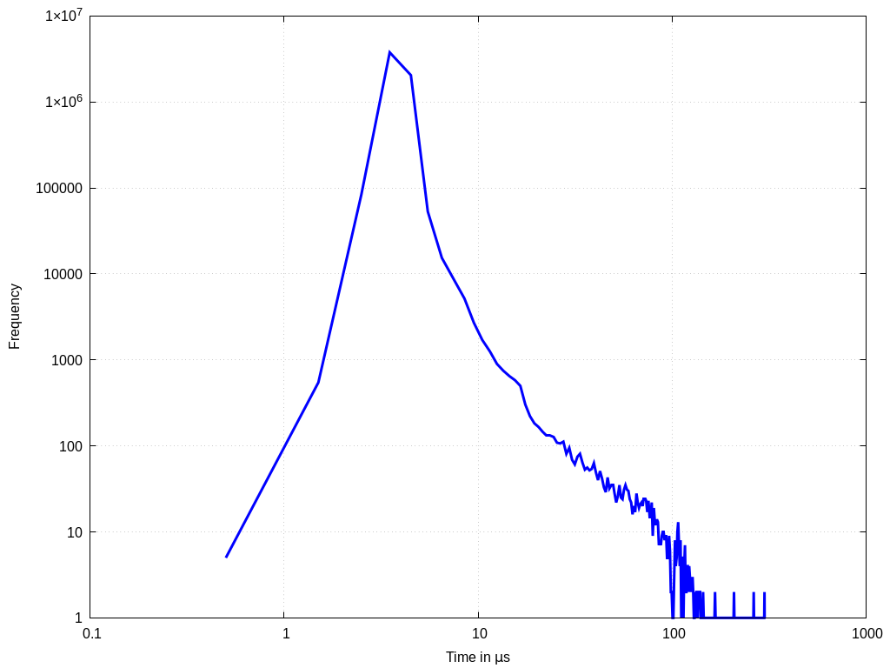
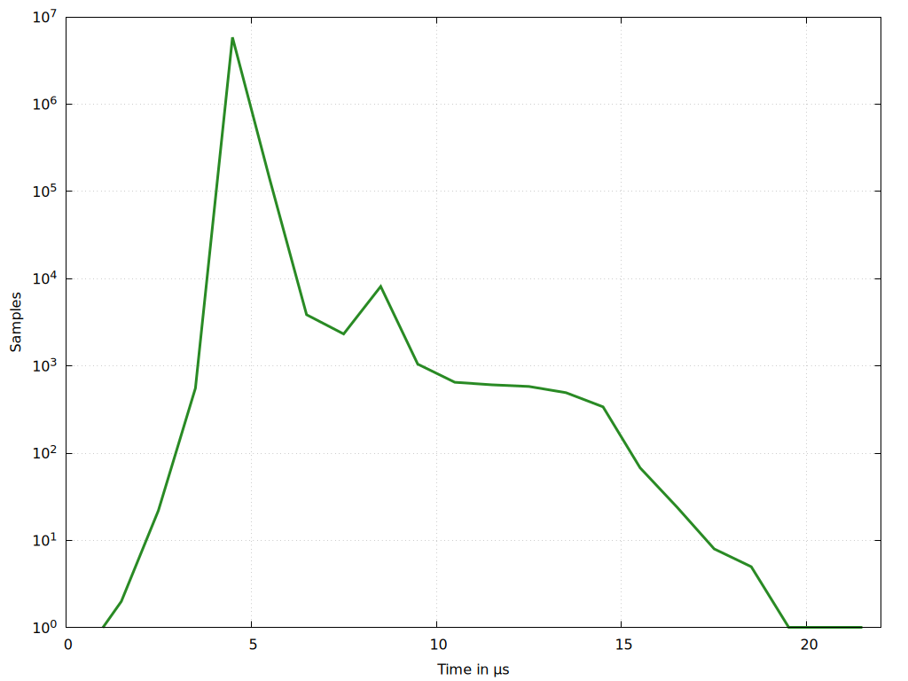
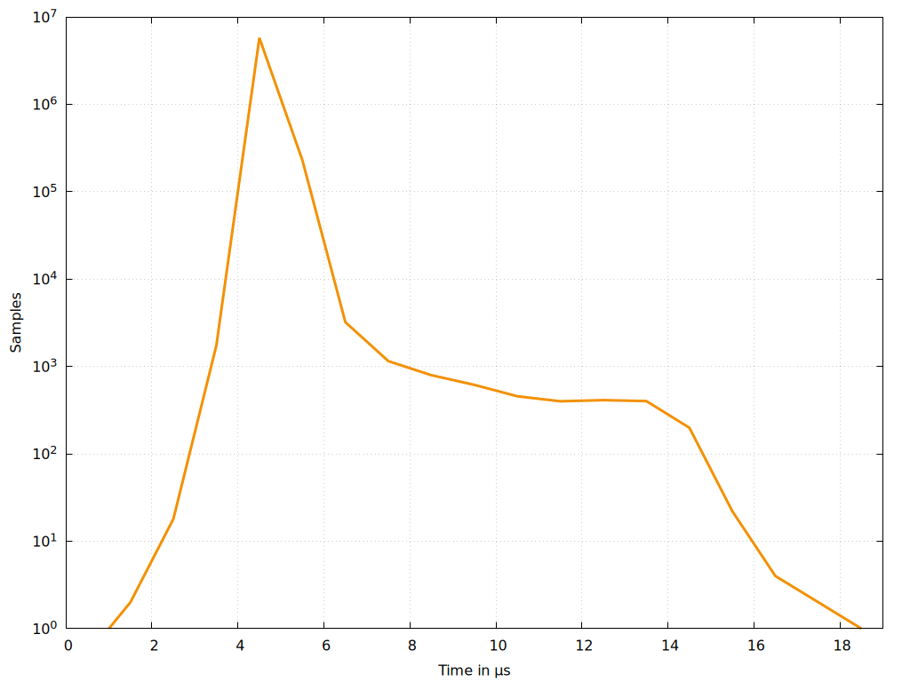
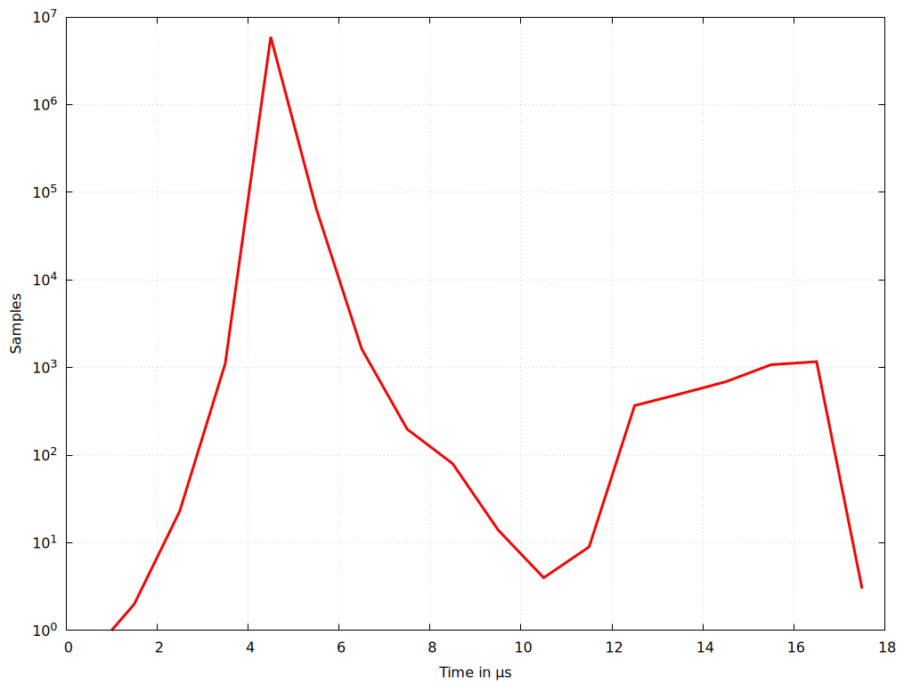
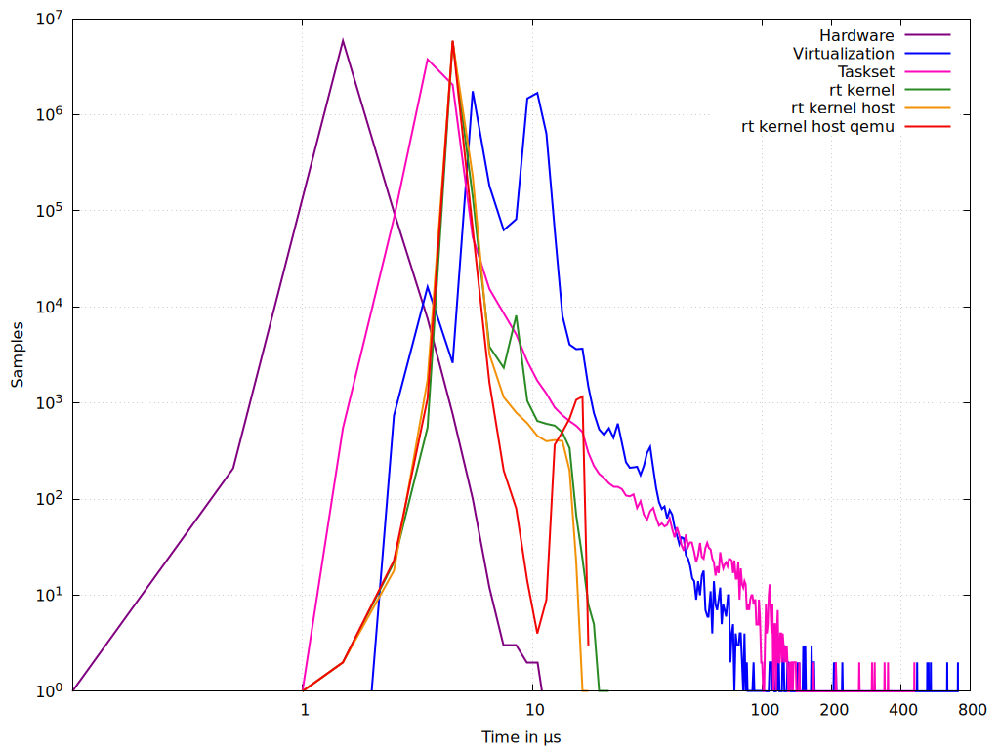

# Salamander 4 latency comparisons

## Salamander 4 Hardware on CP 841

---

## Salamander 4 Default Yocto Build

---

## After taskset -c 4

---

## After BIOS Configurations

---

## After [Host Configurations](../salamander4/latency_reduction/latency_reduction_steps.md#host-configurations)

---

## After [QEMU Configurations](../salamander4/latency_reduction/latency_reduction_steps.md#qemu-configurations)

---

## All together

